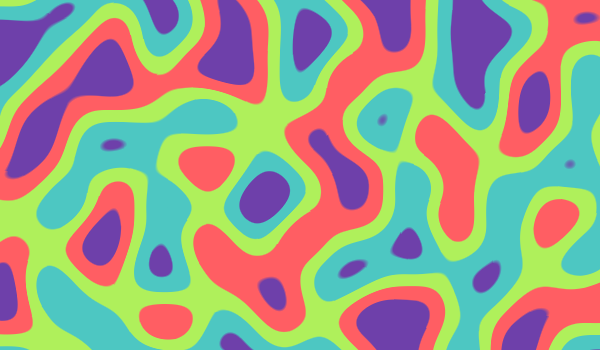

# colorgrad-rs

[](https://crates.io/crates/colorgrad)
[](https://docs.rs/colorgrad)
[](https://github.com/mazznoer/colorgrad-rs/actions)
[](https://travis-ci.org/mazznoer/colorgrad-rs)
[](https://codecov.io/gh/mazznoer/colorgrad-rs)

Rust color scales library for charts, maps, data-visualization and creative coding.

## Index

+ [Custom Gradient](#custom-gradient)
+ [Preset Gradients](#preset-gradients)
+ [Using the Gradient](#using-the-gradient)
+ [Examples](#examples)

## Usage

Add `colorgrad` to your `Cargo.toml`
```toml
[dependencies]
colorgrad = "0.3.0"
```

## Custom Gradient

### Basic

```rust
let g = colorgrad::CustomGradient::new().build()?;
```


### Custom Colors

```rust
use colorgrad::Color;

let g = colorgrad::CustomGradient::new()
    .colors(&[
        Color::from_rgb_u8(0, 206, 209),
        Color::from_rgb_u8(255, 105, 180),
        Color::from_rgb(0.274, 0.5, 0.7),
        Color::from_hsv(50., 1., 1.),
        Color::from_hsv(348., 0.9, 0.8),
    ])
    .build()?;
```


### Using Web Color Format

`.html_colors()` method accepts [named colors](https://www.w3.org/TR/css-color-4/#named-colors), hexadecimal (`#rgb`, `#rgba`, `#rrggbb`, `#rrggbbaa`), `rgb()`, `rgba()`, `hsl()`, `hsla()`, `hwb()`, and `hsv()`.

```rust
let g = colorgrad::CustomGradient::new()
    .html_colors(&["#C41189", "#00BFFF", "#FFD700"])
    .build()?;
```


```rust
let g = colorgrad::CustomGradient::new()
    .html_colors(&["gold", "hotpink", "darkturquoise"])
    .build()?;
```


```rust
let g = colorgrad::CustomGradient::new()
    .html_colors(&["rgb(125,110,221)", "rgb(90%,45%,97%)", "hsl(229,79%,85%)"])
    .build()?;
```


### Domain & Color Position

Default domain is [0..1].

```rust
let g = colorgrad::CustomGradient::new()
    .html_colors(&["deeppink", "gold", "seagreen"])
    .build()?;

assert_eq!(g.domain(), (0., 1.));
```


Set the domain to [0..100].

```rust
let g = colorgrad::CustomGradient::new()
    .html_colors(&["deeppink", "gold", "seagreen"])
    .domain(&[0., 100.])
    .build()?;

assert_eq!(g.domain(), (0., 100.));
```


Set the domain to [-1..1].

```rust
let g = colorgrad::CustomGradient::new()
    .html_colors(&["deeppink", "gold", "seagreen"])
    .domain(&[-1., 1.])
    .build()?;

assert_eq!(g.domain(), (-1., 1.));
```


Set exact position for each color. The domain is [0..1].

```rust
let g = colorgrad::CustomGradient::new()
    .html_colors(&["deeppink", "gold", "seagreen"])
    .domain(&[0., 0.7, 1.])
    .build()?;

assert_eq!(g.domain(), (0., 1.));
```


Set exact position for each color. The domain is [15..80].

```rust
let g = colorgrad::CustomGradient::new()
    .html_colors(&["deeppink", "gold", "seagreen"])
    .domain(&[15., 30., 80.])
    .build()?;

assert_eq!(g.domain(), (15., 80.));
```


### Blending Mode

```rust
let g = colorgrad::CustomGradient::new()
    .html_colors(&["#FFF", "#00F"])
    .mode(colorgrad::BlendMode::Rgb)
    .build()?;
```


## Preset Gradients

All preset gradients are in the domain [0..1].

### Diverging

`colorgrad::br_bg()`


`colorgrad::pr_gn()`


`colorgrad::pi_yg()`


`colorgrad::pu_or()`


`colorgrad::rd_bu()`


`colorgrad::rd_gy()`


`colorgrad::rd_yl_bu()`


`colorgrad::rd_yl_gn()`


`colorgrad::spectral()`


### Sequential (Single Hue)

`colorgrad::blues()`


`colorgrad::greens()`


`colorgrad::greys()`


`colorgrad::oranges()`


`colorgrad::purples()`


`colorgrad::reds()`


### Sequential (Multi-Hue)

`colorgrad::turbo()`


`colorgrad::viridis()`


`colorgrad::inferno()`


`colorgrad::magma()`


`colorgrad::plasma()`


`colorgrad::cividis()`


`colorgrad::warm()`


`colorgrad::cool()`


`colorgrad::cubehelix_default()`


`colorgrad::bu_gn()`


`colorgrad::bu_pu()`


`colorgrad::gn_bu()`


`colorgrad::or_rd()`


`colorgrad::pu_bu_gn()`


`colorgrad::pu_bu()`


`colorgrad::pu_rd()`


`colorgrad::rd_pu()`


`colorgrad::yl_gn_bu()`


`colorgrad::yl_gn()`


`colorgrad::yl_or_br()`


`colorgrad::yl_or_rd()`


### Cyclical

`colorgrad::rainbow()`


`colorgrad::sinebow()`


## Using the Gradient

### Get the domain

```rust
let grad = colorgrad::rainbow();

assert_eq!(grad.domain(), (0., 1.));
```

### Get single color at certain position

```rust
let grad = colorgrad::rainbow();

assert_eq!(grad.at(0.0).rgba_u8(), (110, 64, 170, 255));
assert_eq!(grad.at(0.5).rgba_u8(), (175, 240, 91, 255));
assert_eq!(grad.at(1.0).rgba_u8(), (110, 64, 170, 255));
```

### Get n colors evenly spaced across gradient

```rust
let grad = colorgrad::rainbow();

for c in grad.colors(10) {
    println!("{}", c.to_hex_string());
}
```

Output:

```console
#6e40aa
#c83dac
#ff5375
#ff8c38
#c9d33a
#7cf659
#5dea8d
#48b8d0
#4775de
#6e40aa
```

### Hard-Edged Gradient

Convert gradient to hard-edged gradient with 11 segments and 0 smoothness.

```rust
let g = colorgrad::rainbow().sharp(11, 0.);
```


This is the effect of different smoothness.


## Examples

### Gradient Image

```rust
//extern crate colorgrad;
//extern crate image;

use std::error::Error;

fn main() -> Result<(), Box<dyn Error>> {
    let grad = colorgrad::CustomGradient::new()
        .html_colors(&["deeppink", "gold", "seagreen"])
        .build()?;

    let w = 1500;
    let h = 70;
    let fw = w as f64;

    let mut imgbuf = image::ImageBuffer::new(w, h);

    for (x, _y, pixel) in imgbuf.enumerate_pixels_mut() {
        let (r, g, b, _a) = grad.at(x as f64 / fw).rgba_u8();
        *pixel = image::Rgb([r, g, b]);
    }

    imgbuf.save("gradient.png")?;
    Ok(())
}
```

Example output:


### Colored Noise

```rust
//extern crate colorgrad;
//extern crate image;
//extern crate noise;

use noise::NoiseFn;

fn main() {
    let w = 600;
    let h = 350;
    let scale = 0.015;

    let grad = colorgrad::rainbow().sharp(5, 0.15);
    let ns = noise::OpenSimplex::new();
    let mut imgbuf = image::ImageBuffer::new(w, h);

    for (x, y, pixel) in imgbuf.enumerate_pixels_mut() {
        let t = ns.get([x as f64 * scale, y as f64 * scale]);
        let (r, g, b, _a) = grad.at(remap(t, -0.5, 0.5, 0.0, 1.0)).rgba_u8();
        *pixel = image::Rgb([r, g, b]);
    }
    imgbuf.save("noise.png").unwrap();
}

// Map value which is in range [a, b] to range [c, d]
fn remap(value: f64, a: f64, b: f64, c: f64, d: f64) -> f64 {
    (value - a) * ((d - c) / (b - a)) + c
}
```

Example output:



## Inspirations

* [chroma.js](https://gka.github.io/chroma.js/#color-scales)
* [d3-scale-chromatic](https://github.com/d3/d3-scale-chromatic/)

## Links

* [colorgrad](https://github.com/mazznoer/colorgrad) - Go version of this library
* [Color Blindness Simulator](https://www.color-blindness.com/coblis-color-blindness-simulator/)
* [Visual System Simulator](https://github.com/UniStuttgart-VISUS/visual-system-simulator)
